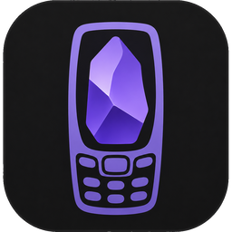

# Noksidian

**An Obsidian port for the Nokia E71** (and any Symbian S60 3rd/5th Edition or MIDP 2.0 +
JSR-75 phone). A J2ME MIDlet that gives you your vault on a 2008 candybar: browse, read,
edit and link markdown notes, view images, and sync the whole vault with a GitHub repo —
automatically, with automatic conflict resolution.

The interface is a hand-built Canvas UI toolkit with a true-black, Obsidian-purple theme
(light mode too) — every screen is drawn by the app, so the phone's stock widgets never
show through. App icon: a Nokia keypad phone cradling the Obsidian crystal.

```
 ┌──────────────────────────────┐
 │ Noksidian        ⇅ synced    │
 │ ──────────────────────────── │
 │  ..                          │
 │  Daily/                      │
 │  Projects/                   │
 │  # Home lab.md               │
 │  Reading list.md             │
 │  vault-map.png               │
 │ Menu                  Open   │
 └──────────────────────────────┘
```

## Features

- **Library / vault browser** — navigate folders, create/rename/delete notes and folders,
  filename + full-text search.
- **Vault setup wizard** — first run lets you pick any folder on phone memory or the
  microSD card (`E:/`) and turns it into a vault.
- **Markdown viewer** with Obsidian flavor: headings, bold/italic/bold-italic, strikethrough,
  `==highlight==`, inline code + fenced code blocks, blockquotes, callouts (`> [!note]`),
  bullet/numbered/task lists with nesting, tables (monospace), horizontal rules, frontmatter
  (shown as a properties box), `%%comments%%` (hidden).
- **Links**: `[[wikilinks]]` (with `|alias` and `#heading`), markdown links, autolinks
  (open in the phone browser), `#tags` (tap to search), link navigation with the D-pad.
  Following a wikilink to a note that doesn't exist offers to create it — like Obsidian.
- **Images**: `![[image.png]]` and `` render inline (scaled to fit),
  full-screen image viewer with 1:1 zoom and panning.
- **Editing** — a themed full-screen editor (great with the E71 QWERTY), UTF-8 throughout.
- **Daily notes** — a *Today* command opens `Daily/YYYY-MM-DD.md` (folder configurable),
  creating it with a date heading if it doesn't exist yet.
- **Light & dark themes** (true black) across the whole app, and a **Font size** setting
  with every crisp pixel size the phone supports — its 3 native sizes plus integer-scaled
  larger ones, shown as "N px".
- **Resume** — optionally reopen the last note on startup, so the phone wakes up exactly
  where you left it.
- **Encrypted vaults (optional)** — AES-256 + HMAC-SHA256 with a PBKDF2 password; unlock
  when the vault opens (or remember on this phone). Choose whether GitHub stores
  ciphertext too (*Phone + GitHub*) or plaintext (*Phone only*); `tools/nokcrypt.py` reads
  and writes the same format on the desktop. See [docs/encryption.md](docs/encryption.md).
- **GitHub sync** — syncs *whenever it can*: on startup, ~20 s after every save, on a timer
  (5/15/30/60 min), with exponential-backoff retries when the network is down. Conflicts are
  resolved **automatically** with a real line-based 3-way merge; when both sides changed the
  same lines you choose the policy: *Keep both* (git-style markers, nothing is ever lost),
  *Prefer phone*, or *Prefer GitHub*. Deletes propagate both ways (remote deletions go to
  `.noksidian/trash/` on the phone, never hard-deleted).
- **Obsidian compatible** — it's all plain markdown in plain folders. Point desktop Obsidian
  at a clone of the same repo (e.g. with the community *obsidian-git* plugin) and the E71
  becomes just another synced device.

## Documentation

Start at the [documentation index](docs/index.md), or jump straight to a doc:

- [User guide](docs/user-guide.md) — the complete manual: every screen, key, menu and setting.
- [Building & installing](docs/install.md) — from clone to a running MIDlet on the E71.
- [GitHub sync](docs/sync.md) — token, TLS bridge, settings, and exactly what every sync pass does.
- [Troubleshooting & FAQ](docs/troubleshooting.md) — symptom-indexed fixes for sync, phone and vault problems.
- [Markdown reference](docs/markdown-reference.md) — every construct the parser understands, and what is not supported.
- [Architecture](docs/architecture.md) — developer deep-dive: platform constraints, module map, data flow, toolchain.
- [CONTRACTS.md](CONTRACTS.md) — the authoritative class signatures and behavioral contracts.

## What about official Obsidian Sync?

Directly: never — it's a proprietary end-to-end encrypted WebSocket protocol over
TLS 1.2/1.3 with modern AES-GCM, and the E71's Java stack tops out at TLS 1.0 with none of
those primitives. But you don't have to give it up: keep your other devices on Obsidian
Sync and let **one** desktop relay the vault into a GitHub repo with the *obsidian-git*
plugin; the E71 syncs that repo and every device converges. Full topology, step-by-step
setup and the encrypted-vault variant:
[docs/obsidian-sync-setup.md](docs/obsidian-sync-setup.md).

## The TLS catch (read this!)

`api.github.com` requires TLS 1.2+; the E71 speaks TLS 1.0. Two options:

1. **Bridge (recommended)** — run the included TLS bridge on any always-on machine on your
   LAN (Pi, NAS, PC):

   ```
   python3 tools/ghproxy.py          # listens on :8180, forwards to api.github.com
   ```

   In Noksidian → *Settings* → **API URL** enter `http://<machine-ip>:8180`. Everything else
   is unchanged. ⚠️ The phone↔bridge hop is plain HTTP on your LAN, so use a **fine-grained
   PAT** scoped to just the vault repo, on a network you trust.
2. Any other TLS-1.2-terminating reverse proxy pointed at `https://api.github.com` works the
   same way (nginx, Caddy, ...).

## Build

Everything is local and self-contained (the `tools/` folder holds JDK 8, ProGuard and the
CLDC/MIDP/JSR-75 API jars — downloaded by the setup, no system installs needed):

```
./build.sh     # -> dist/Noksidian.jar + dist/Noksidian.jad
./test.sh      # desktop unit tests for the core (markdown parser, merge, json, ...)
```

The pipeline: `javac -source 1.3 -target 1.3` against real CLDC 1.1/MIDP 2.0 API jars →
ProGuard `-microedition` preverification (CLDC StackMap attributes) → MIDlet JAR + JAD.

## Install on the E71

Any one of:
- **Bluetooth**: send `dist/Noksidian.jar` to the phone, open the received file, install.
- **microSD**: copy the jar to the card, open it with the phone's File manager.
- **PC Suite/OVI Suite**: install `dist/Noksidian.jad` + `.jar`.

Then, to stop Symbian asking for permission on every file/network access:
*Menu → Installations → App. mgr. → Noksidian → Options → Settings* (or *Suite settings*) →
set **Read user data / Edit user data / Network access** to **Ask first time only**.

## First run

1. **Pick a vault folder** (e.g. `E:/Vault`) or create one — the wizard walks you through it.
2. Open **Settings**: GitHub owner, repo, branch (default `main`), token, API URL
   (direct or your bridge), auto-sync interval, conflict policy. Hit **Test**.
3. **Sync now.** An empty phone vault pulls the whole repo (markdown *and* images);
   an empty repo receives your phone files. Both non-empty? It merges.

Create the token at github.com → *Settings → Developer settings → Fine-grained tokens*:
one repository (the vault), permission **Contents: Read and write**.

## How sync works

`.noksidian/` inside the vault (never synced) holds `state.json` (the blob sha of every file
at last sync), `base/` (the last-synced text of each note — the merge base), and `trash/`.
Each pass lists the remote tree, scans local files, and classifies every path: new here →
push, new there → pull, changed one side → take it, changed both sides → 3-way merge (pushed
back immediately), deleted → propagate. Binary files (images, anything not markdown) use
size+mtime change detection and never merge: on a true conflict the remote copy is saved next to yours as
`name (remote).ext`. Every push is a commit like `Noksidian: update Daily/2026-07-01.md`.

## Limitations

- Markdown that needs a real engine is out: Mermaid, LaTeX math, Dataview and other plugins.
  (Tables render as monospace text; footnotes render literally.)
- Repos beyond GitHub's tree-listing limit (~100k files) or files > 1.5 MB are skipped.
- One commit per changed file (the Contents API model) — history is chatty but correct.
- JPEG/PNG/GIF only, as supported by the phone's decoder; huge images show a placeholder.

## Project layout

```
src/nok/core/   markdown parser, 3-way merge, json, base64, paths, note index (pure, unit-tested)
src/nok/sys/    JSR-75 file access, RMS config, HTTP engine
src/nok/sync/   GitHub REST client + the sync engine
src/nok/ui/     canvas markdown renderer, image viewer, library, editor, settings, vault picker
tools/          self-contained toolchain + ghproxy.py TLS bridge
```
